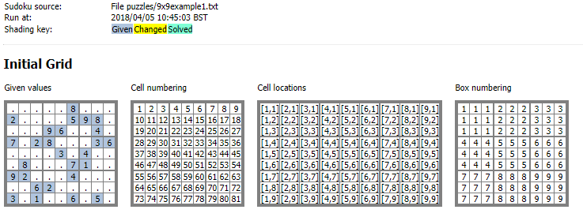
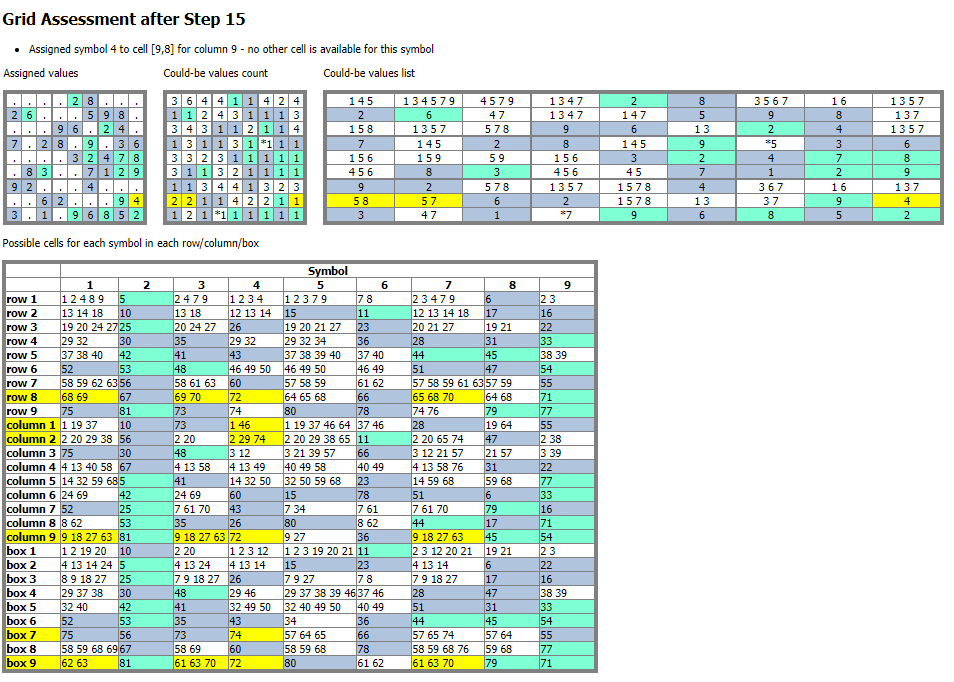
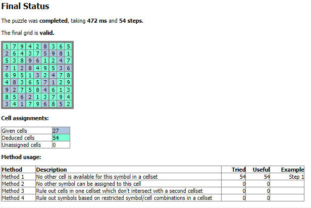

# JavaSudokuSolver
A Java program which attempts to solve a Sudoku puzzle by making step-by-step logical deductions to make cell assignments and/or rule out other assignments. The
program generates a detailed HTML file of diagnostics output to show its detailed reasoning.

The Sudoku puzzle is read from a file, see the *examples* folder for a couple of example files. Recognised grid layouts are:
* 9x9, using symbols 1-9 or A-I
* 16x16, using symbols A-P
* 25x25, using symbols A-Y
* 6x6, using symbols 1-6

Puzzle files can contain comment lines, starting with a '#', and whitespace within lines in the file is ignored. Use a '.' to represent unknowns in the puzzle.

To run the program against a puzzle file run a command line based on:

`java -jar jar/sudoku.jar <filename>`

for example:

`java -jar jar/sudoku.jar examples/9x9example1.txt`

This shows some basic output on standard output and writes detailed diagnostics to a file called *diagnostics.html* in the current directory. To place the 
diagnostics file in a different location, specify a second parameter on the command line:

`java -jar jar/sudoku.jar <filename> <diagnosticsfilefolder>`

The *examples* folder also contains examples of the diagnostics files produced for the example puzzle files. The diagnostics file shows the assignment/ruling-out performed 
during each processing step as the puzzle is solved. (Note that the program does not try any brute-force methods - if its deduction methods are not successful, it will get stuck 
and not completely solve the puzzle.) Screenshots from an example diagnostics file are shown below.

## Screenshot of initial puzzle diagnostics ##

## Screenshot showing diagnostic details of a processing step ##

## Screenshot of final puzzle diagnostics ##

